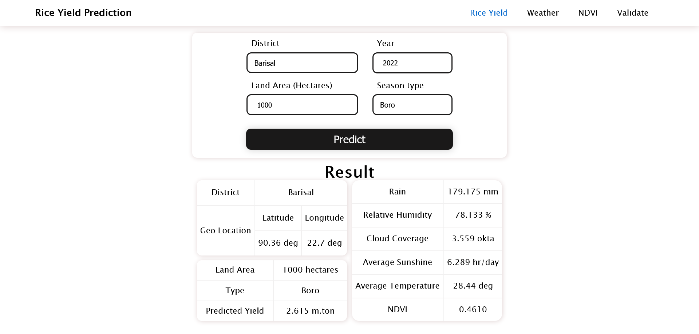
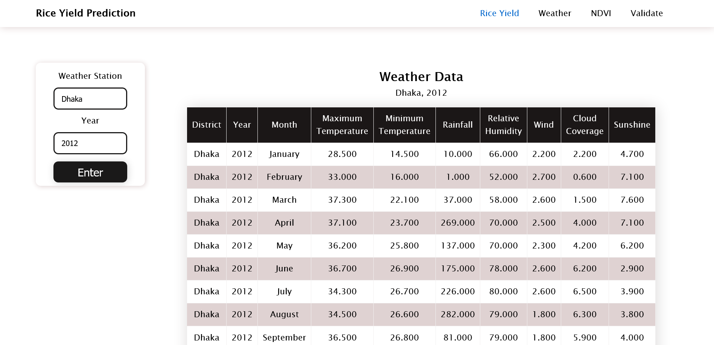
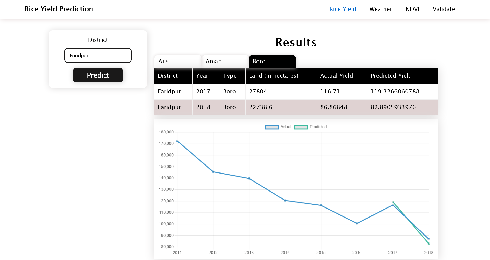

# Rice-Yield-Prediction-View

This is an web application for the Rice Yield Prediction API. Following are the some of the screenshot from the application.

## Predicting yield for a particular land size in a given area

## Showing previous weather data for a location 

## Comparison between previous data and prediction
Chart was created using [Chart.js](https://www.chartjs.org/)

